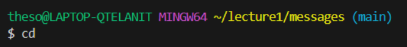
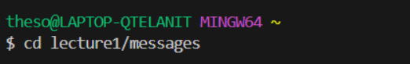
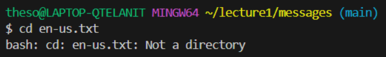
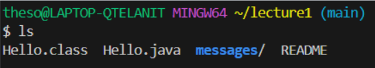
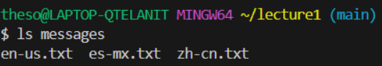
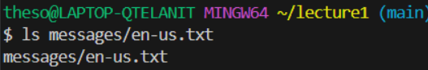
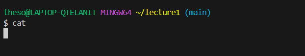
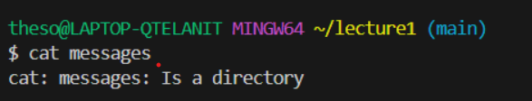
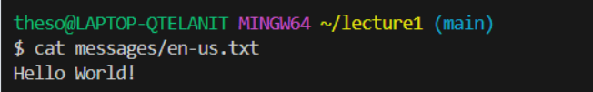

#"cd" Change directory:  

1:    Absolute Path: `C:/Users/theso/lecture1/messages`    having nothing in the arugment would take us back to the home directory, in this case it is `theso`.    `NOT` an error   
2:     `Absolute Path: C:/Users/theso`    There exists the directory named `messages` with the `lecture1` folder, therefore it directs there.    `NOT` an error   
3:     Absolute Path: `C:/Users/theso/lecture1/messages`    a text file cannot be used as a directory for `cd`. 
     `error` because it doesn't move us to the specified file directory 

#"ls" list:  

1:     Absolute Path: `C:/Users/theso/lecture1 `   `ls` lists everything in the `lecture1` folder(containing `Hello.class`, `Hello.java`...) and it does so sucessfully   `NOT` an error   
2:     Absolute Path: `C:/Users/theso/lecture1`    `ls` with provided path to `messages` folder, lists everything in the text folder(containing `en-us.txt`, `es-mx.txt`...) and does so exhaustively   `NOT` an error   
3:     Absolute Path: `C:/Users/theso/lecture1`   `ls` provided a specific path lists everything at this specific file, in this case it is `en-us.txt`, because it is provided a specific file, `ls` lists the specific file   `NOT` an error   

#"cat" :  

1:     Absolute Path: `C:/Users/theso/lecture1`    `cat` with 0 arguments just returns any string you input   `not` exactly an error, `cat` will just run in an loop where it will return any standard input.  
2:     Absolute Path: `C:/Users/theso/lecture1`     a directory file cannot be read as a text file.   `error` because a directory file itself cannot be read.  
3:     Absolute Path: `C:/Users/theso/lecture1`    `cat` sucessfuly reads the textfile and prints the string within the textfile `NOT` an error   
